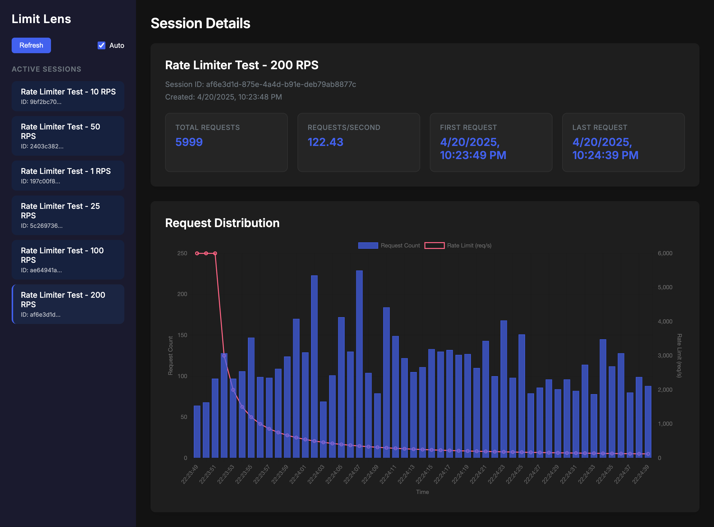

# Limit Lens

A simple API for testing and visualizing rate limiters in real-time. Monitor request throughput and see how your rate limiting algorithms perform under load.

## Table of Contents

- [Limit Lens](#limit-lens)
  - [Table of Contents](#table-of-contents)
  - [Features](#features)
  - [Installation](#installation)
    - [Using Docker Compose](#using-docker-compose)
    - [Building from source](#building-from-source)
  - [Usage](#usage)
    - [Using the Dashboard](#using-the-dashboard)
    - [Using the Rust Client](#using-the-rust-client)
    - [Using the API directly](#using-the-api-directly)
      - [Creating a test session](#creating-a-test-session)
      - [Generating load](#generating-load)
      - [Viewing metrics](#viewing-metrics)
      - [API References](#api-references)
  - [Testing](#testing)
    - [Running the tests](#running-the-tests)
  - [License](#license)
  - [Contributing](#contributing)

## Features

- Create test sessions to benchmark rate limiters
- Generate configurable load patterns
- Visualize request distribution in real-time
- Analyze rate limiter performance metrics
- Access a real-time dashboard at `http://localhost:6969/dashboard` to monitor all sessions

## Installation

### Using Docker Compose

```bash
# Clone the repository
git clone https://github.com/akhileshsharma99/limit-lens
cd limit-lens

# Start the server with Docker Compose
docker compose up -d

# Stop the server after testing
docker compose down
```
### Building from source

```bash
# Clone the repository
git clone https://github.com/akhileshsharma99/limit-lens
cd limit-lens

# Build the project
cargo build --release

# Run the server
cargo run --release
```

The server will start on `http://localhost:6969`.

## Usage

You can interact with Limit Lens either directly through the Rust client, by using the provided API, or through the visual dashboard.

### Using the Dashboard

Once the server is running, access the dashboard at `http://localhost:6969/dashboard` to:
- View all active test sessions
- Monitor request distribution in real-time
- Analyze performance metrics for your rate limiters
- Track requests per second and total throughput



### Using the Rust Client

First, add the client to your Rust project:

```bash
cargo add limit-lens
```

Then, use it in your code:

```rust
use limit_lens::apis::{configuration::Configuration, rate_test_api, health_api};
use limit_lens::models::CreateSessionRequest;

async fn main() -> Result<(), Box<dyn std::error::Error>> {
    // Set up client configuration
    let config = Configuration::default();
    
    // Check API health
    let health = health_api::health_check(&config).await?;
    println!("API Health: {}", health);
    
    // Create a new test session
    let session_request = CreateSessionRequest::new();
    let session = rate_test_api::create_test_session(&config, session_request).await?;
    println!("Created session with ID: {}", session.id);
    
    // Send test requests
    for _ in 0..10 {
        let response = rate_test_api::receive_test_request(&config, &session.id).await?;
        println!("Request status: {}", response.status());
    }
    
    // Get metrics for the session
    let metrics = rate_test_api::get_test_metrics(&config, &session.id).await?;
    println!("Total requests: {}", metrics.total_requests);
    println!("Requests per second: {}", metrics.requests_per_second);
    
    // Print request distribution
    for bucket in metrics.request_distribution {
        println!("Time: {}, Count: {}", bucket.timestamp, bucket.count);
    }
    
    Ok(())
}
```

### Using the API directly

#### Creating a test session

```bash
curl -X POST http://localhost:6969/api/test/session \
  -H "Content-Type: application/json" \
  -d '{"name": "My Test Session"}'
```

This will return a session ID that you can use for testing.

#### Generating load

You can use any HTTP load testing tool. For example, with curl in a loop:

```bash
for i in {1..100}; do
  curl http://localhost:6969/api/test/request/{session_id} &
done
```

#### Viewing metrics

```bash
curl http://localhost:6969/api/test/metrics/{session_id}
```

#### API References

Complete API documentation is available at:

- ReDoc UI: [http://localhost:6969/redoc](http://localhost:6969/redoc)

## Testing

Limit Lens includes integration tests that verify the rate limiting functionality under different load scenarios.

### Running the tests

The integration tests require [Vegeta](https://github.com/tsenart/vegeta) - an HTTP load testing tool to generate controlled HTTP load.

To install Vegeta:
- On macOS: `brew install vegeta`
- On Linux: Download from [GitHub releases](https://github.com/tsenart/vegeta/releases)
- On Windows: Use [Chocolatey](https://chocolatey.org/): `choco install vegeta`

To run the rate limit scenario tests with output:

```bash
cargo test test_rate_limit_scenarios -- --nocapture
```

This will run tests with various load patterns (low, medium, and high rates) and verify that the system correctly tracks and reports metrics.

## License

This project is licensed under the [MIT License](./LICENSE).

## Contributing

Contributions are welcome! Please feel free to submit a Pull Request.
